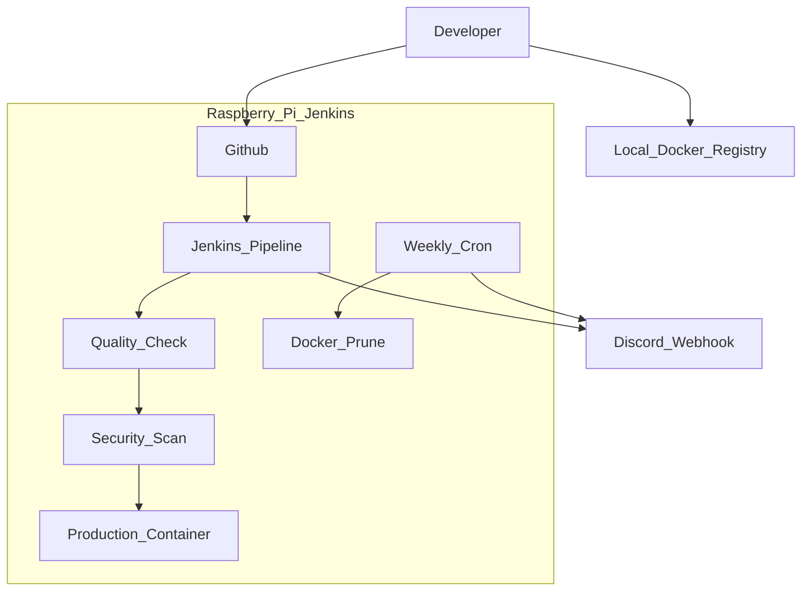

# 🚀 Raspberry Pi DevSecOps Pipeline

> **A fully automated, secure, and self-healing CI/CD pipeline running on ARM64 architecture (Raspberry Pi).**


## 📋 Project Overview

This project demonstrates a complete **End-to-End DevSecOps Pipeline** built on **limited hardware resources (Raspberry Pi ARM64)**.

The pipeline automates:
- Application build & deployment
- Quality validation
- Container security scanning
- Zero-touch maintenance
- Interactive rollback for production safety

All processes run **fully automated** with real-time notifications via **Discord Webhook**.

## 🏗️ Architecture Workflow




## 🛠️ Key Features

### 🛡️ 1. DevSecOps Integration (Trivy)

Security is **not an afterthought**.

- Every Docker image is scanned using **Aqua Security Trivy**
- The pipeline **FAILS automatically** if:
  - `CRITICAL` or `HIGH` vulnerabilities are detected
- Optimized for **ARM64 (Raspberry Pi)** using cached vulnerability database

### 🕹️ 2. Parameterized Build & Rollback

Interactive Jenkins pipeline using **Build with Parameters**:

- **Deploy Latest**
  - Automatically builds and deploys from the latest Git commit
- **Rollback**
  - Instantly revert production to a specific **Git Commit Hash**
  - Designed for emergency recovery when bugs reach production

### 🧹 3. Automated Self-Healing (Cron Job)

A dedicated **Janitor Job** runs automatically:

- 🕓 **Schedule**: Every Sunday at 04:00 AM
- 🧽 **Actions**:
  - Prune unused Docker images
  - Remove dangling volumes
  - Clear Docker build cache
- 🎯 **Result**:
  - Prevents storage overflow
  - Extends SD Card lifespan
  - Maintains Raspberry Pi stability


### 🔔 4. Real-time Monitoring (Discord)

Integrated **Discord Webhook notifications**:

- ✅ **Success Notification**
  - Build status
  - Deployed version (Git commit hash)
  - Production website URL
- ❌ **Failure Notification**
  - Quality check failures
  - Security vulnerabilities detected
  - Pipeline execution errors

## 🔧 Tech Stack

| Component        | Technology      | Description                                   |
|------------------|----------------|-----------------------------------------------|
| Orchestrator     | Jenkins        | CI/CD pipeline & workflow automation          |
| Containerization | Docker         | Application, Jenkins, and Registry            |
| Security         | Trivy          | Container vulnerability scanner               |
| Web Server       | Nginx Alpine   | Lightweight production web server             |
| Notifications    | Discord API    | Real-time pipeline notifications              |
| Hardware         | Raspberry Pi 4 | ARM64 server infrastructure                   |

## 📸 Screenshots (Evidence)

1. **Pipeline Success (Green Build)**  
   _Place Jenkins pipeline success screenshot here_

2. **Interactive Rollback Menu**  
   _Place "Build with Parameters" screenshot here_

3. **Security Scanning & Discord Alerts**  
   _Place Trivy scan output & Discord notification screenshot here_

## 📝 Usage

### 🚀 Deployment Command

```bash
./deploy.sh "Your commit message here"
./test_quality.sh
```

## Author

Created by **Akhsan Daffa**  
ARM64 • Raspberry Pi • DevSecOps • Automation